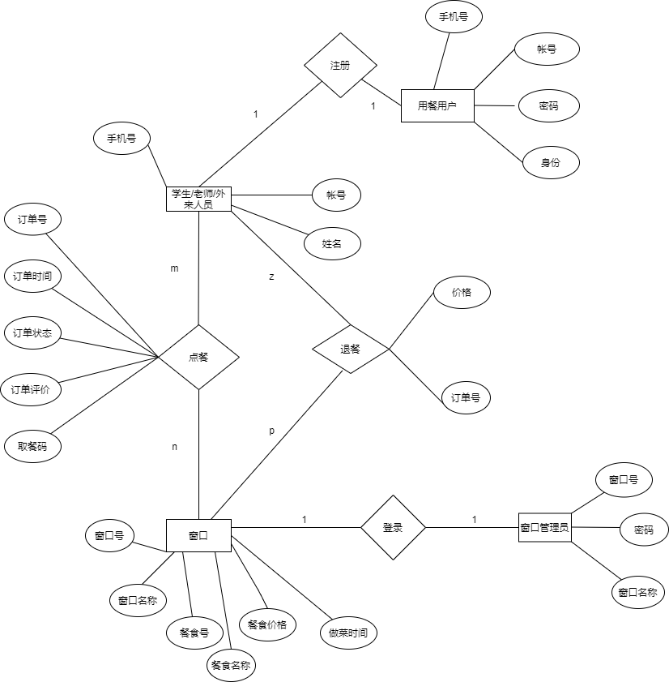

# 丰园点餐开发文档

## 需求

对丰园餐厅用餐实行手机点餐制度，避免排队时间过长，食堂阿姨漏记学生用餐忌口，忘记同学的餐食种类。

点餐系统作用：无论身处何地，都可点餐，系统提供餐食需要等待的时间，学生可在餐食快要做好时去餐厅用餐，避免排队、食堂拥挤，在系统上还可一目了然食堂餐食种类。

以丰三为例（除过自选冒菜、烤盘饭、串串香，可在系统上显示需在食堂点餐）

## 数据库设计

### ER图设计

我们设置以下实体，用户、窗口、餐食 

ER属性见下表

- 实体：

  用户、窗口、餐食

- 属性

  用户属性：学号（主码）、姓名、登录密码

  窗口属性：窗口号（主码）、窗口名称、餐食号（主码）、餐食名称、价格、做菜时间
  
  窗口管理员：窗口号、姓名、登录密码 

- 关系
   
  点餐

  退餐

  注册

  登录 

ER图如下

### 数据库表设计

**用餐用户表**

| 属性名 | 类型        |
| ------ | ----------- |
| 账号   | varchar(30) |
| 密码   | varchar(50) |
| 姓名   | char(50)    |
| 手机号 | char(15)    |

**窗口信息表**

| 属性名 | 类型        |
| ------ | ----------- |
| 窗口号 | char(15)    |
| 密码   | varchar(50) |
| 窗口名 | varchar(50) |

**餐食表**

| 属性名   | 类型                 |
| -------- | -------------------- |
| 餐食号   | char（10）           |
| 餐食名称 | varchar（50）        |
| 餐食价格 | float（5）           |
| 制作时长 | float（2）分钟为单位 |

**订单表**

| 属性名   | 类型                                         |
| -------- | -------------------------------------------- |
| 订单号   | char（50）                                   |
| 餐食号   | char（10）                                   |
| 窗口号   | char(15)                                     |
| 订单状态 | char(1) 未完成、已完成、付款、未付款、已退款 |
| 评价     | 暂不设置                                     |

**退餐表**   *注意与订单状态相符*

| 属性名 | 类型       |
| ------ | ---------- |
| 订单号 | char（50） |
| 价格   | float（5） |

## 开发任务

- 登录注册系统

  **登录**

    实现商家和学生用户的注册登录功能

    选择商家、用户身份登录

    将输入的用户名与密码与数据库中的数据进行对比验证

  **注册**

    选择商家用户、用户两种身份注册

    将注册信息存入数据库

    对密码进行加密

  **信息维护修改**
    
    包括修改密码、修改个人信息

- 点餐端

  **查看菜品**

  据窗口等分类查看

  **点菜** 

  对菜品进行点菜 付款 取菜 （评价）
  
  取消订单

  

- 窗口端
  
  **管理菜单**

  实现对菜品的管理、编辑菜单

  **查看已有订单**

  根据时间、种类等排序

  **接单**

  接受订单，生成取餐码，给出预计出餐时间
  

  **出餐** 
  
   对菜品出餐，改变订单状态

## 设计思路 （具体开发时决定）
对于丰园餐厅点菜系统的设计思路
### 用户和窗口的登录注册系统
- 用户登录界面
注册界面有：身份（下拉选项有学生、教职工、外来人员）
账号（学生为学号；教职工为教工号；外来人员为临时号）
姓名
密码（自主设置）
手机号
注册
登录界面有：
账号
密码 
登录 and 注册

- 窗口登录界面
这里我建议直接将窗口的信息通过SQL放入数据库中，直接登录，因为如果注册的话，窗口号位数、餐食号很容易混乱，直接在SQL里内置好。（或者在程序端直接限定格式）
 丰园餐厅三层是6个窗口
登录界面有：窗口号
             窗口名称
             密码
             登录
- 信息维护修改
窗口和用户界面设计修改密码和相关用户资料

### 窗口的菜单管理系统
- 各个窗口管理菜品的界面
  界面中展示现有菜品，增加相应编辑功能

- 各个窗口的接单界面
接单界面：订单号
          接收 and 拒绝（一般餐馆都是自动接收）
如果点击接收则弹出
          取餐码
          预计取餐等待时间
（此界面信息应在用户点餐系统出现）

- 各个窗口订单界面
查看订单界面有：排列的订单号以及后跟着的订单创建时间，餐食号，餐食种类，订单状态（按时间先后排序）
点击订单

## 点菜管理系统
- 设计各个窗口

## 实现思路

待补充

## 任务分工

- 开发程序

| 开发任务               | 人员   |
| ---------------------- | ------ |
| 登录、注册             | 肖梦晗 |
| 信息维护修改           | 舒治怡 |
| 查看菜品               | 张嘉璐 |
| 点菜                   | 李培源 |
| 管理菜单、查看已有订单 | 李雪   |
| 接单、出餐             | 唐家豪 |

- 设计思路PPT和应用系统视频制作
  

## 注意事项

- 数据库的建立完全依照文档标准，保证大家写的都能用，可以做一些兼容的改动，比如增加属性
- 注意写好注释
- 开发完成某一个功能后后，大概写一下思路，方便大家参考理解以及最后的PPT制作
- 首先在Github上fork下[主仓库](https://github.com/jihanuo/Fengyuan_Student_Cafeteria_Ordering_System) 在这个结构下开发 方便代码合并更新

## 参考资料

- Github的使用
[Github Desktop 纯萌新入门教程](https://nexmoe.com/3VXH932.html)
[使用github-廖雪峰](https://www.liaoxuefeng.com/wiki/896043488029600/900937935629664)
[GitHub Desktop 文档](https://docs.github.com/zh/desktop)
[如何在 Github 上规范的提交 PR（图文详解）](https://zhuanlan.zhihu.com/p/584834288)
